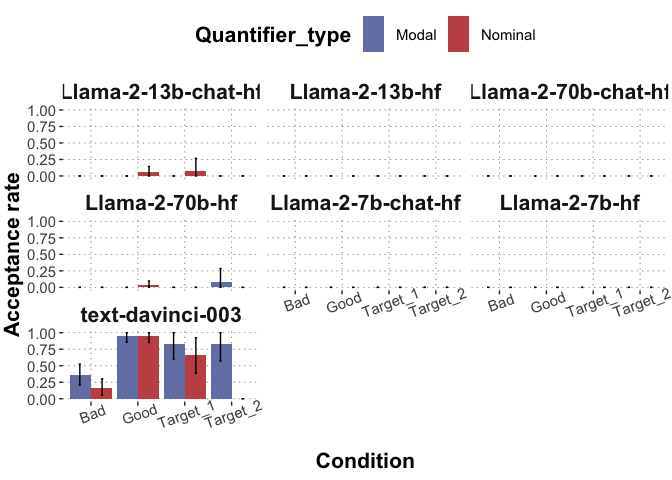
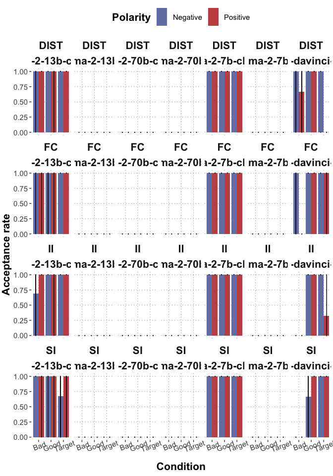
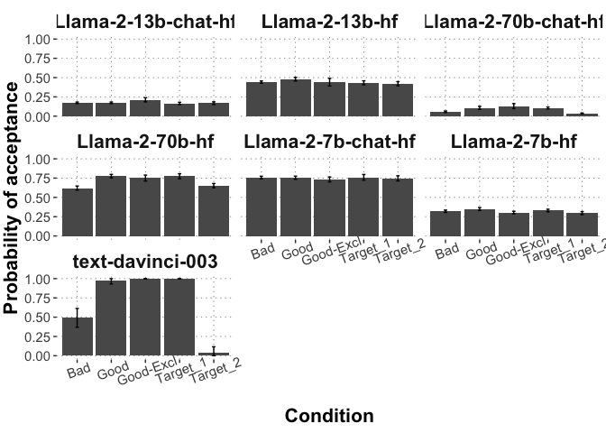
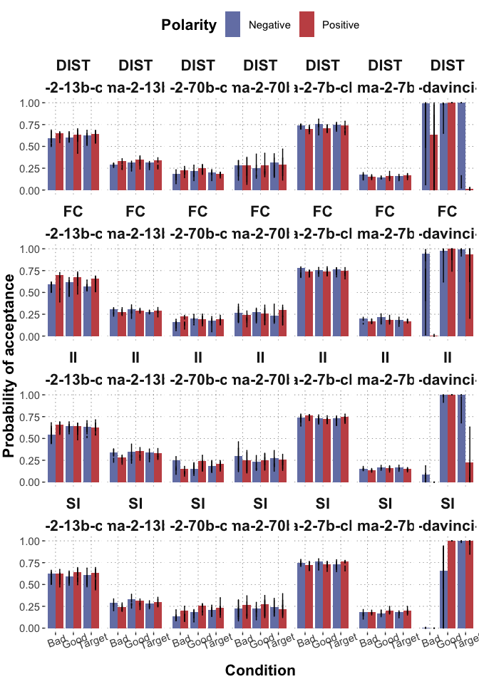

Myster box inferences descriptive stats
================
PT
2023-12-16

# Overview

We explore the performance of text-davinci-003 and all Llama-2 models
(both base and chat) on experiments 1-3 from Degano et al 2024,
experiments 1-2 from Marty et al 2023 and experiments 4-6 from Marty et
al 2022. All practice trials are used as a few-shot prompt (i.e. correct
solutions were presented).

The results were retrieved by retrieving the log probability of the
labels “good” / “bad” following the prompt. The selected answer is
identified by selecting the max probability. For simplicity, the prompts
are linked here:

- [Degano et al
  2024](https://github.com/CogSciPrag/mysteryBox-inferences/blob/main/data/prompts/Deganoetal2024_instructions.txt)
- [Marty et al
  2023](https://github.com/CogSciPrag/mysteryBox-inferences/blob/main/data/prompts/Martyetal2023_instructions.txt)
- [Marty et al
  2022](https://github.com/CogSciPrag/mysteryBox-inferences/blob/main/data/prompts/Martyetal2022_instructions.txt)

# Analysis

Below we analyse the selected response. We apply two analyses: first, we
compute the proportion of responses predicting that the trigger sentence
is “good” by checking whether the “good” response was assigned the
higher LLH / probability (trial-level). Furthermore, we compute the
probability assigned to each response by applying softmax (alpha = 1) to
LLH’s from each trial and then averaging over the response probabilities
by condition.

``` r
process_response <- function(d) {
d <- d %>% 
  rowwise() %>%
  mutate(
    chosen_response_llh = max(Mean_logprob_answer_good, Mean_logprob_answer_bad),
    chosen_response = ifelse(chosen_response_llh == Mean_logprob_answer_good, "Mean_logprob_answer_good", "Mean_logprob_answer_bad"),
    chosen_response = str_split(chosen_response, "_", simplify=T)[,4],
    norm_factor = sum(exp(Mean_logprob_answer_good), exp(Mean_logprob_answer_bad)),
    prob_good = exp(Mean_logprob_answer_good) / norm_factor,
    prob_bad = exp(Mean_logprob_answer_bad) / norm_factor
  )
  return(d)
}
```

We apply these analyses by-study and then group the respective stats by
conditions of each respective study.

``` r
degano2024_processed <- process_response(degano2024)
marty2023_processed <- process_response(marty2023)
marty2022_processed <- process_response(marty2022)

degano2024_acc_rate <- degano2024_processed %>% 
  mutate(
    is_good = as.numeric(chosen_response == "good")
  ) %>% 
  group_by(model, Condition) %>% 
  tidyboot_mean(column = is_good)
```

    ## Warning: `as_data_frame()` was deprecated in tibble 2.0.0.
    ## ℹ Please use `as_tibble()` instead.
    ## ℹ The signature and semantics have changed, see `?as_tibble`.
    ## ℹ The deprecated feature was likely used in the purrr package.
    ##   Please report the issue at <]8;;https://github.com/tidyverse/purrr/issueshttps://github.com/tidyverse/purrr/issues]8;;>.

    ## Warning: `cols` is now required when using unnest().
    ## Please use `cols = c(strap)`

``` r
degano2024_acc_rate
```

    ## # A tibble: 35 × 7
    ## # Groups:   model [7]
    ##    model               Condition     n empirical_stat ci_lower   mean ci_upper
    ##    <chr>               <chr>     <int>          <dbl>    <dbl>  <dbl>    <dbl>
    ##  1 Llama-2-13b-chat-hf Bad          54         0        0      0         0    
    ##  2 Llama-2-13b-chat-hf Good         45         0        0      0         0    
    ##  3 Llama-2-13b-chat-hf Good-Excl     9         0        0      0         0    
    ##  4 Llama-2-13b-chat-hf Target_1     18         0        0      0         0    
    ##  5 Llama-2-13b-chat-hf Target_2     18         0        0      0         0    
    ##  6 Llama-2-13b-hf      Bad          54         0.185    0.0847 0.185     0.298
    ##  7 Llama-2-13b-hf      Good         45         0.356    0.217  0.355     0.489
    ##  8 Llama-2-13b-hf      Good-Excl     9         0.222    0      0.209     0.5  
    ##  9 Llama-2-13b-hf      Target_1     18         0.167    0      0.164     0.353
    ## 10 Llama-2-13b-hf      Target_2     18         0.0556   0      0.0543    0.2  
    ## # … with 25 more rows

``` r
marty2023_summary <- marty2023_processed %>% 
  mutate(
    is_good = as.numeric(chosen_response == "good")
  ) %>% 
  group_by(model, Quantifier_type, Condition) %>% 
  tidyboot_mean(column = is_good)
```

    ## Warning: `cols` is now required when using unnest().
    ## Please use `cols = c(strap)`

``` r
marty2023_summary
```

    ## # A tibble: 56 × 8
    ## # Groups:   model, Quantifier_type [14]
    ##    model               Quantifier…¹ Condi…²     n empir…³ ci_lo…⁴   mean ci_up…⁵
    ##    <chr>               <chr>        <chr>   <int>   <dbl>   <dbl>  <dbl>   <dbl>
    ##  1 Llama-2-13b-chat-hf Modal        Bad        36  0            0 0        0    
    ##  2 Llama-2-13b-chat-hf Modal        Good       36  0            0 0        0    
    ##  3 Llama-2-13b-chat-hf Modal        Target…    12  0            0 0        0    
    ##  4 Llama-2-13b-chat-hf Modal        Target…    12  0            0 0        0    
    ##  5 Llama-2-13b-chat-hf Nominal      Bad        36  0            0 0        0    
    ##  6 Llama-2-13b-chat-hf Nominal      Good       36  0.0556       0 0.0561   0.143
    ##  7 Llama-2-13b-chat-hf Nominal      Target…    12  0.0833       0 0.0778   0.267
    ##  8 Llama-2-13b-chat-hf Nominal      Target…    12  0            0 0        0    
    ##  9 Llama-2-13b-hf      Modal        Bad        36  0            0 0        0    
    ## 10 Llama-2-13b-hf      Modal        Good       36  0            0 0        0    
    ## # … with 46 more rows, and abbreviated variable names ¹​Quantifier_type,
    ## #   ²​Condition, ³​empirical_stat, ⁴​ci_lower, ⁵​ci_upper

``` r
marty2022_summary <- marty2022_processed %>%
  mutate(
    is_good = as.numeric(chosen_response == "good")
  ) %>% 
  group_by(model, Negation, Polarity, Inference_type, Condition) %>% 
  tidyboot_mean(column = is_good)
```

    ## Warning: `cols` is now required when using unnest().
    ## Please use `cols = c(strap)`

``` r
marty2022_summary
```

    ## # A tibble: 504 × 10
    ## # Groups:   model, Negation, Polarity, Inference_type [168]
    ##    model     Negat…¹ Polar…² Infer…³ Condi…⁴     n empir…⁵ ci_lo…⁶  mean ci_up…⁷
    ##    <chr>     <chr>   <chr>   <chr>   <chr>   <int>   <dbl>   <dbl> <dbl>   <dbl>
    ##  1 Llama-2-… High    Negati… DIST    Bad         3   0.667       0 0.657       1
    ##  2 Llama-2-… High    Negati… DIST    Good        3   1           1 1           1
    ##  3 Llama-2-… High    Negati… DIST    Target      3   1           1 1           1
    ##  4 Llama-2-… High    Negati… FC      Bad         3   0.667       0 0.657       1
    ##  5 Llama-2-… High    Negati… FC      Good        3   1           1 1           1
    ##  6 Llama-2-… High    Negati… FC      Target      3   1           1 1           1
    ##  7 Llama-2-… High    Negati… II      Bad         3   0.667       0 0.687       1
    ##  8 Llama-2-… High    Negati… II      Good        3   1           1 1           1
    ##  9 Llama-2-… High    Negati… II      Target      3   1           1 1           1
    ## 10 Llama-2-… High    Negati… SI      Bad         3   1           1 1           1
    ## # … with 494 more rows, and abbreviated variable names ¹​Negation, ²​Polarity,
    ## #   ³​Inference_type, ⁴​Condition, ⁵​empirical_stat, ⁶​ci_lower, ⁷​ci_upper

The processed data is saved such that the probabilities of each response
option as well as the selected response are included on top of the raw
materials csvs (**columns prob_good, prob_bad, chosen_response**), along
with the information which model was used to produce the results.

# Plots

Below, we plot the mean acceptance rate (i.e., the mean proportion of
judgments that a trigger sentence is good) by-model, by experiment and
by-condition.

Plot for Degano et al 2024:

``` r
degano2024_acc_rate %>% 
  ggplot(., aes(x = Condition, y = mean, ymin = ci_lower, ymax = ci_upper)) +
  geom_col() +
  geom_errorbar(width = 0.1) +
  facet_wrap(~model) +
  ylab("Acceptance rate") +
  theme_csp() +
  theme(axis.text.x = element_text(angle=20)) 
```

<!-- -->

Marty et al 2023:

``` r
marty2023_summary %>% 
  ggplot(., aes(x = Condition, y = mean, fill = Quantifier_type, ymin = ci_lower, ymax = ci_upper)) +
  geom_col(position = position_dodge()) +
  geom_errorbar(position = position_dodge(0.95), width = 0.1) +
  facet_wrap(~model) +
  ylab("Acceptance rate") +
  theme_csp() +
  theme(axis.text.x = element_text(angle=20)) 
```

<!-- -->

Marty et al 2022:

``` r
marty2022_summary %>% 
  ggplot(., aes(x = Condition, y = mean, fill = Polarity, ymin = ci_lower, ymax = ci_upper)) +
  geom_col(position = position_dodge()) +
  geom_errorbar(position = position_dodge(0.95), width = 0.1) +
  facet_wrap(Inference_type~model, nrow = 4) +
  ylab("Acceptance rate") +
  theme_csp() +
  theme(axis.text.x = element_text(angle=20)) 
```

<!-- -->

Now the same plots are replicated with the average probability assigned
to the “acceptance” response.

    ## # A tibble: 35 × 7
    ## # Groups:   model [7]
    ##    model               Condition     n empirical_stat ci_lower  mean ci_upper
    ##    <chr>               <chr>     <int>          <dbl>    <dbl> <dbl>    <dbl>
    ##  1 Llama-2-13b-chat-hf Bad          54          0.174    0.164 0.174    0.184
    ##  2 Llama-2-13b-chat-hf Good         45          0.173    0.164 0.173    0.184
    ##  3 Llama-2-13b-chat-hf Good-Excl     9          0.214    0.186 0.214    0.239
    ##  4 Llama-2-13b-chat-hf Target_1     18          0.166    0.151 0.166    0.180
    ##  5 Llama-2-13b-chat-hf Target_2     18          0.169    0.151 0.168    0.186
    ##  6 Llama-2-13b-hf      Bad          54          0.442    0.427 0.442    0.456
    ##  7 Llama-2-13b-hf      Good         45          0.479    0.456 0.479    0.503
    ##  8 Llama-2-13b-hf      Good-Excl     9          0.446    0.391 0.444    0.491
    ##  9 Llama-2-13b-hf      Target_1     18          0.432    0.407 0.432    0.459
    ## 10 Llama-2-13b-hf      Target_2     18          0.420    0.395 0.421    0.448
    ## # … with 25 more rows

    ## # A tibble: 56 × 8
    ## # Groups:   model, Quantifier_type [14]
    ##    model               Quantifier_…¹ Condi…²     n empir…³ ci_lo…⁴  mean ci_up…⁵
    ##    <chr>               <chr>         <chr>   <int>   <dbl>   <dbl> <dbl>   <dbl>
    ##  1 Llama-2-13b-chat-hf Modal         Bad        36   0.368   0.352 0.369   0.386
    ##  2 Llama-2-13b-chat-hf Modal         Good       36   0.355   0.338 0.355   0.372
    ##  3 Llama-2-13b-chat-hf Modal         Target…    12   0.366   0.336 0.366   0.400
    ##  4 Llama-2-13b-chat-hf Modal         Target…    12   0.353   0.328 0.352   0.378
    ##  5 Llama-2-13b-chat-hf Nominal       Bad        36   0.360   0.346 0.360   0.374
    ##  6 Llama-2-13b-chat-hf Nominal       Good       36   0.371   0.354 0.371   0.390
    ##  7 Llama-2-13b-chat-hf Nominal       Target…    12   0.341   0.307 0.342   0.386
    ##  8 Llama-2-13b-chat-hf Nominal       Target…    12   0.361   0.327 0.360   0.396
    ##  9 Llama-2-13b-hf      Modal         Bad        36   0.293   0.278 0.293   0.309
    ## 10 Llama-2-13b-hf      Modal         Good       36   0.334   0.318 0.335   0.353
    ## # … with 46 more rows, and abbreviated variable names ¹​Quantifier_type,
    ## #   ²​Condition, ³​empirical_stat, ⁴​ci_lower, ⁵​ci_upper

    ## # A tibble: 504 × 10
    ## # Groups:   model, Negation, Polarity, Inference_type [168]
    ##    model     Negat…¹ Polar…² Infer…³ Condi…⁴     n empir…⁵ ci_lo…⁶  mean ci_up…⁷
    ##    <chr>     <chr>   <chr>   <chr>   <chr>   <int>   <dbl>   <dbl> <dbl>   <dbl>
    ##  1 Llama-2-… High    Negati… DIST    Bad         3   0.580   0.498 0.579   0.688
    ##  2 Llama-2-… High    Negati… DIST    Good        3   0.602   0.581 0.602   0.615
    ##  3 Llama-2-… High    Negati… DIST    Target      3   0.612   0.523 0.611   0.685
    ##  4 Llama-2-… High    Negati… FC      Bad         3   0.575   0.500 0.573   0.621
    ##  5 Llama-2-… High    Negati… FC      Good        3   0.618   0.552 0.618   0.670
    ##  6 Llama-2-… High    Negati… FC      Target      3   0.564   0.523 0.564   0.643
    ##  7 Llama-2-… High    Negati… II      Bad         3   0.549   0.449 0.547   0.680
    ##  8 Llama-2-… High    Negati… II      Good        3   0.640   0.625 0.640   0.658
    ##  9 Llama-2-… High    Negati… II      Target      3   0.630   0.577 0.630   0.668
    ## 10 Llama-2-… High    Negati… SI      Bad         3   0.537   0.501 0.537   0.590
    ## # … with 494 more rows, and abbreviated variable names ¹​Negation, ²​Polarity,
    ## #   ³​Inference_type, ⁴​Condition, ⁵​empirical_stat, ⁶​ci_lower, ⁷​ci_upper

``` r
degano2024_prob %>% 
  ggplot(., aes(x = Condition, y = mean, ymin = ci_lower, ymax = ci_upper)) +
  geom_col() +
  geom_errorbar(width = 0.1) +
  facet_wrap(~model) +
  ylab("Probability of acceptance") +
  theme_csp() +
  theme(axis.text.x = element_text(angle=20)) 
```

<!-- -->

``` r
marty2023_prob %>% 
  ggplot(., aes(x = Condition, y = mean, fill = Quantifier_type, ymin = ci_lower, ymax = ci_upper)) +
  geom_col(position = position_dodge()) +
  geom_errorbar(position = position_dodge(0.95), width = 0.1) +
  facet_wrap(~model) +
  ylab("Probability of acceptance") +
  theme_csp() +
  theme(axis.text.x = element_text(angle=20)) 
```

<!-- -->

``` r
marty2022_prob %>% 
  ggplot(., aes(x = Condition, y = mean, fill = Polarity, ymin = ci_lower, ymax = ci_upper)) +
  geom_col(position = position_dodge()) +
  geom_errorbar(position = position_dodge(0.95), width = 0.1) +
  facet_wrap(Inference_type~model, nrow = 4) +
  ylab("Probability of acceptance") +
  theme_csp() +
  theme(axis.text.x = element_text(angle=20)) 
```

<!-- -->
